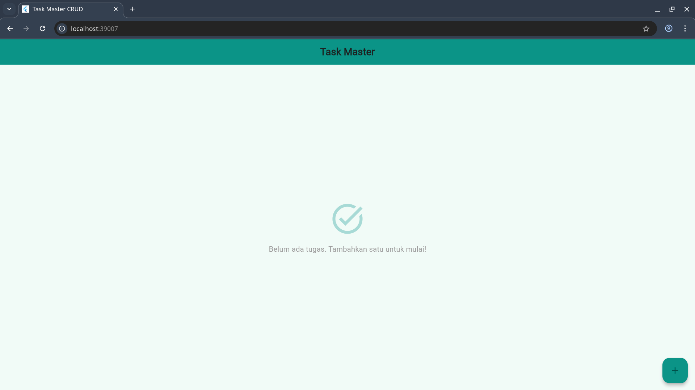
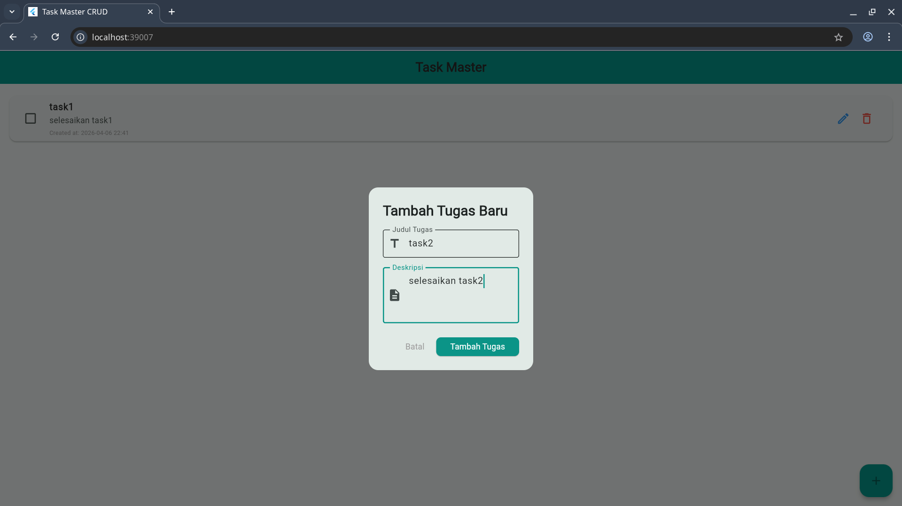

# Aplikasi Manajemen Tugas (Task Master) — Tugas 3

Penyusunan repositori ini merupakan bagian dari pengerjaan **Tugas 3 - Pemrograman Perangkat Bergerak (Section 4: Form & CRUD)** di Institut Teknologi Sepuluh Nopember (ITS). Fokus utama dari proyek ini adalah mengimplementasikan sistem CRUD (Create, Read, Update, Delete) yang solid dengan arsitektur **MVC (Model-View-Controller)** yang terstruktur dan adaptif di berbagai platform.

---

## Tampilan Aplikasi

Berikut adalah dokumentasi antarmuka aplikasi saat dijalankan di lingkungan Chrome (Web):

### 1. Keadaan Awal (Empty State)
Saat aplikasi pertama kali dibuka dan belum ada data, sistem akan menampilkan ilustrasi dan pesan informatif untuk mengarahkan pengguna.


### 2. Form Tambah Tugas
Proses penambahan tugas menggunakan komponen *Dialog* yang bersih, dilengkapi dengan validasi input untuk memastikan integritas data.


### 3. Daftar Tugas & Status Selesai
Data yang tersimpan ditampilkan dalam bentuk list yang reaktif. Pengguna dapat menandai tugas sebagai selesai (perubahan gaya visual coret), mengedit, atau menghapus tugas.


---

## Fitur Unggulan

*   **Penerapan CRUD Penuh**: Mendukung siklus data lengkap mulai dari pembuatan hingga penghapusan tugas.
*   **Arsitektur MVC yang Bersih**: Pemisahan tegas antara Model (Data), View (UI), dan Controller (Logika Bisnis) untuk kemudahan pemeliharaan kode.
*   **UI Reaktif & Material 3**: Antarmuka yang modern, responsif, dan memberikan feedback instan kepada pengguna tanpa perlu refresh manual.
*   **Strategi Hybrid Persistence**: Solusi cerdas untuk menangani penyimpanan lokal lintas platform (Mobile & Web).

---

## Detail Teknis & Arsitektur

Salah satu tantangan terbesar dalam proyek ini adalah memastikan tingkat persistensi data yang stabil di lingkungan Web tanpa mengorbankan performa Mobile.

### 1. Pola MVC (Model-View-Controller)
- **Model** (`task.dart`): Mendefinisikan struktur data tugas dan logika serialisasi (JSON/Map).
- **View** (`home_view.dart`): Bertanggung jawab menampilkan data dari stream secara reaktif menggunakan `StreamBuilder`.
- **Controller** (`task_controller.dart`): Menjadi jembatan antara UI dan database, mengontrol alur data secara terpusat.

### 2. Hybrid Storage Logic
Untuk mendapatkan stabilitas maksimal, aplikasi ini menggunakan dua "mesin" database yang berbeda:
*   **Isar Database** (Mobile): Digunakan pada Android/iOS untuk performa tinggi dan fitur relasi yang kaya.
*   **Hive CE** (Web): Digunakan pada Chrome untuk menjamin data tetap tersimpan permanen di IndexedDB. Langkah ini diambil karena limitasi teknis pada library Isar versi Web saat ini.

### 3. Penanganan Limitasi 32-bit
Selama pengembangan, ditemukan isu limitasi integer pada IndexedDB di Chrome yang menyebabkan crash jika menggunakan ID berbasis timestamp (64-bit). Solusinya, saya menerapkan **Safe Auto-Increment** pada Hive untuk memastikan ID tugas selalu berada dalam rentang yang aman bagi sistem 32-bit Web.

---

## Struktur Proyek

```text
lib/
├── models/      # Data entities & serialization
├── controllers/ # Business logic & data flow
├── services/    # Database initializations (Isar & Hive)
├── views/       # Main screen components
└── widgets/     # Reusable UI components
```

## Cara Menjalankan

1.  Pastikan Flutter SDK (v3.41.6) dan FVM sudah terpasang.
2.  Jalankan `fvm flutter pub get` untuk instalasi package.
3.  Untuk menjalankan di Web:
    ```bash
    fvm flutter run -d chrome
    ```
4.  Untuk menjalankan di Mobile (Android/iOS):
    ```bash
    fvm dart run build_runner build
    fvm flutter run
    ```

---
**Hormat saya,**

**re1c**  
*Pemrograman Perangkat Bergerak (E)*  
*Institut Teknologi Sepuluh Nopember (ITS)*
